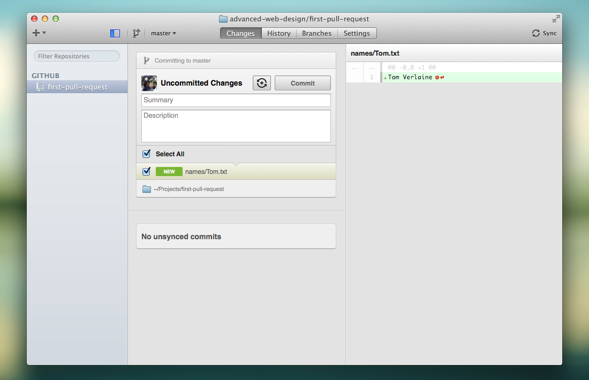

# first-pull-request

> This is a repo for students to practice making a pull request

## Step 1: Fork & Clone the Repository

From https://github.com/advanced-web-design/first-pull-request click the **Fork** button located at the top right of the page.

This will make a copy of this repository under your account:

> https://github.com/YOUR-USERNAME/first-pull-request

From your copy, click the **Clone In Desktop** button located on the right side of the page.

Select a folder location to save this project and click "Clone".

## Step 2: Make Changes

Using your text editor, add a **new file** in the `names/` folder of the repository that contains your name. Save it as **YourFirstName.txt**.

When you have made this addition you are ready to make a **commit**. A commit is a snapshot of your project at certain point in time. *It is like saving a version of all of the files in your project.*

Switch back to GitHub for Mac and click **first-pull-request** in the Repositories list. On the right, you can see a **diff** showing the changes.

To commit these changes, type a commit summary and click **Commit**.

To send the changes to Github, click the **Sync** button in the upper-right of the GitHub for Mac window.

## Step 3: Making a Pull Request

A pull request is a way to add your changes to the original project.

In your web browser, navigate to https://github.com/advanced-web-design/first-pull-request.

Click the green **Compare and Review** button.

On the Compare page, click **Create pull request**.

Type a title and description of your pull request and click the **Create pull request.** button.